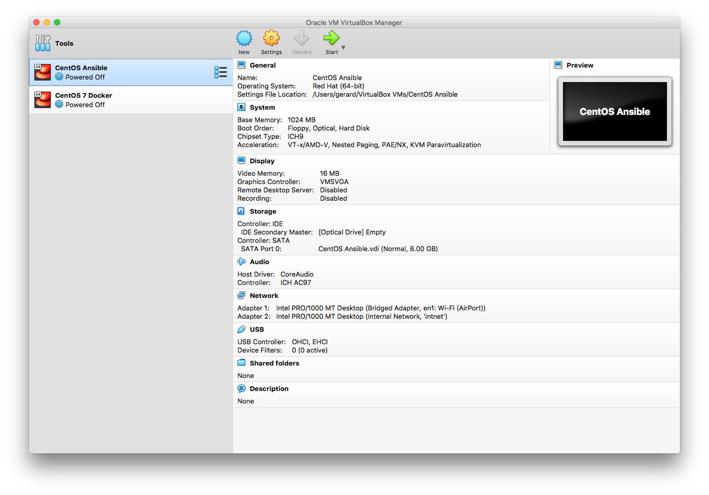
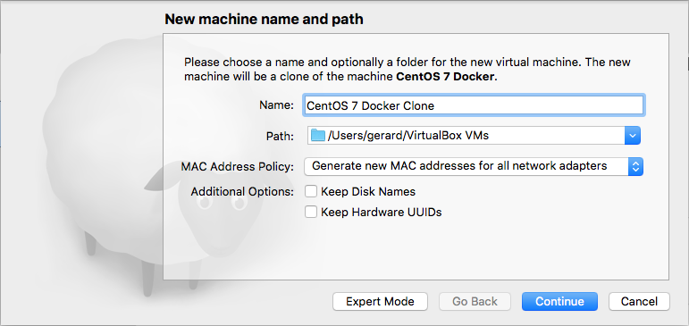
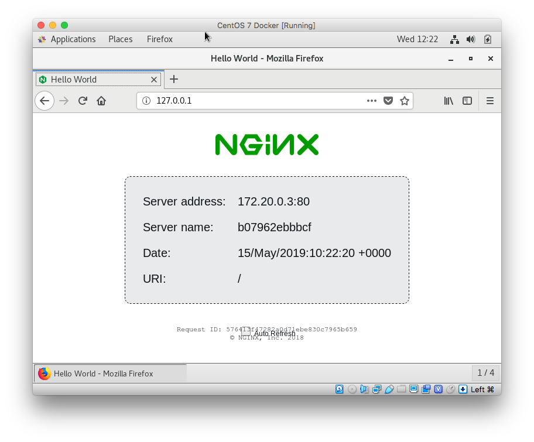

# Challenge

In this repository you will find a scalable solution to the following request:

* Create a git-repo 
* Create two Docker containers containing web servers who listen on a specific port and give a unique response. For example: 'Hello World 1' and 'Hello World 2'
* Create another Docker container which loadbalances in round-robin mode the incoming request over the two web servers. The load balancer receives requests through port 80.
* Create an Ansible playbook which deploys the three containers in a fresh Docker host VM running Linux automatically.

## Getting Started

This challange has been resolved using two Virtual Box VMs running both CentOS 7 Linux. One VM acts as the Ansible Control Machine the other VM acts as a Docker host.

The quickest way to do this is to install one VM, for example the ansible host, with CentOS 7. Be sure to set the root password and add a non-root user and assign a password to this use. Then install the VirtualBox Extension Pack and VirtualBox Guest Additions and then clone this VM. The cloned VM you could then rename to CentOS 7 Docker. In order to prevent networking issues please be sure to select the "Generate new MAC addresses for all network adapters" MAC Address Policy:

### Preparing the Ansible Control Machine

Login as the non-root user and check whether this user is a member of the wheel group. The wheel group allows us to issue the sudo command.

    [gerard@stlo-dhcp-64-44 ~]$ id
    uid=1000(gerard) gid=1000(gerard) groups=1000(gerard),10(wheel) context=unconfined_u:unconfined_r:unconfined_t:s0-s0:c0.c1023
    [gerard@stlo-dhcp-64-44 ~]$ 

If the user is not in the wheel group, the issue the following command to do so:

    [gerard@stlo-dhcp-64-44 ~]$ usermod -aG wheel gerard

In order to be able to connect to the Docker VM without issuing a password we can use a SSH certificate.

    [gerard@stlo-dhcp-64-44 .ssh]$ ssh-keygen -ssh-keygen -t rsa -b 4096 
    Generating public/private rsa key pair.
    Enter file in which to save the key (/home/gerard/.ssh/id_rsa): 
    Enter passphrase (empty for no passphrase): 
    Enter same passphrase again: 
    Your identification has been saved in /home/gerard/.ssh/id_rsa.
    Your public key has been saved in /home/gerard/.ssh/id_rsa.pub.
    The key fingerprint is:
    SHA256:NTSkSbePDfKxIoUgIJuJcxKzXCm023+4H+s/HiNAkUE gerard@steelo.net
    The key's randomart image is:
    +---[RSA 4096]----+
    |*o..+Eo ..=      |
    |+Ooo o.o = o     |
    |Ooo  .. = *      |
    | +o .  . + O     |
    | . . .. S + o    |
    |    . o. .       |
    |     o + o       |
    |      o +.o      |
    |     .o+oo.      |
    +----[SHA256]-----+
    
Next start up the Docker VM. Make sure you can reach the Docker VM. Note it's IP address or hostname, and then copy over the SSH id:

    [gerard@stlo-dhcp-64-44 .ssh]$ ssh-copy-id -i id_rsa gerard@192.168.64.46
    /usr/bin/ssh-copy-id: INFO: Source of key(s) to be installed: "id_rsa.pub"
    /usr/bin/ssh-copy-id: INFO: attempting to log in with the new key(s), to filter out any that are already installed
    /usr/bin/ssh-copy-id: INFO: 1 key(s) remain to be installed -- if you are prompted now it is to install the new keys
    gerard@192.168.64.46's password: 

    Number of key(s) added: 1

    Now try logging into the machine, with:   "ssh 'gerard@192.168.64.46'" and check to make sure that only the key(s) you wanted were added.
    
    [gerard@stlo-dhcp-64-44 .ssh]$

We are now ready to install Ansible. 
The Ansible software is in the EPEL repository and this repository first needs to be added to the Ansible Control Machine VM:

    [gerard@stlo-dhcp-64-44 ~]$ sudo yum install epel-release -y

Followed by the install command:

    [gerard@stlo-dhcp-64-44 ~]$ sudo yum install ansible -y
    
This will install a Python 2.7 based Ansible. You need to use dnf in order to use a Python 3 based Ansible.

### Copy the Ansible Playbook to the Ansible Control Machine

Copy this 'challenge' directory from your workstation to the /var/tmp directory on the Ansible Control Machine:

    [gerard@stlo-dhcp-64-44 ~]$ scp -rp ./challenge gerard@192.168.64.44:/var/tmp/

## The Challenge

### Running the Ansible Playbook

Logon to the Ansible Control Machine, change to the Playbook directory.
Change the provisioning/hosts.yml file so that it reflects your situation (user, host and ssh port) 

    ---
    all:
      hosts:
        docker1:
          ansible_connection: ssh
          ansible_user: gerard # Remote user
          ansible_host: 192.168.64.46 # Remote host
          ansible_port: 22
          
 make sure that the correct non-user is specified in the provisioning/site.yml file:
 
    ---
    # This playbook sets up whole stack.

    - name: Configurations to "remote" host
      hosts: docker1
      remote_user: gerard
      become: yes
      become_method: sudo
      roles:
        - setup

    - name: Copying "docker" application folder on remote server
      hosts: docker1
      remote_user: gerard
      become: yes
      become_method: sudo
      roles:
        - app

Change the remote_user, your non-root user, and, if preferred, the directory on the docker host where the Docker files will be stored in the provisioning/host_vars/docker1 file: 

    ---
    # Variables listed here are applicable to "setup" role

    ansible_python_interpreter: /usr/bin/python2.7

    remote_user: gerard
    docker_group: docker

    docker_remote_app_dir: /tmp/challenge                              
          
 and run the Ansible Playbook and provide the SUDO password for your non-root user on the Ansible Control Machine.

    [gerard@stlo-dhcp-64-44 ~]$ cd /var/tmp/challenge
    [gerard@stlo-dhcp-64-44 challenge]$ ansible-playbook provisioning/site.yml -i provisioning/hosts.yml --ask-become-pass
    SUDO password: 

### The Result

After the playbook successfully succeeds you should have 1 load balancer plus two webserver's provisioned.
When pointing the web browser to 127.0.0.1:80 (or the IP-address of the Docker server) it should give you, each time you hit refresh, a unique to the web server page with details about the web server instance.

After logging in to the Docker host we see the following:
Docker images:

    [gerard@stlo-dhcp-64-46 ~]$ docker images
    REPOSITORY          TAG                 IMAGE ID            CREATED             SIZE
    challenge_lb        latest              b49c55c1ffd3        11 hours ago        721MB
    challenge_web       latest              77ce4f49dec2        11 hours ago        721MB
    centos              latest              9f38484d220f        2 months ago        202MB
    [gerard@stlo-dhcp-64-46 ~]$ 

Docker containers: 

    [gerard@stlo-dhcp-64-46 ~]$ docker ps -a
    CONTAINER ID        IMAGE               COMMAND                  CREATED             STATUS              PORTS                                     NAMES
    3bdaff9dce23        challenge_web       "nginx -g 'daemon of…"   9 seconds ago       Up 5 seconds        80/tcp, 443/tcp                            challenge_web_1
    b07962ebbbcf        challenge_web       "nginx -g 'daemon of…"   9 seconds ago       Up 5 seconds        80/tcp, 443/tcp                            challenge_web_2
    c82bddc46fa1        challenge_lb        "nginx -g 'daemon of…"   9 seconds ago       Up 5 seconds        0.0.0.0:80->80/tcp, 0.0.0.0:443->443/tcp   challenge_lb_1
    
You can scale the number of web servers. To have 10 web servers instead you could use the docker-compose command as follows:

 
    [gerard@stlo-dhcp-64-46 docker]$ docker-compose up -d --scale web=10

Example webpage:

